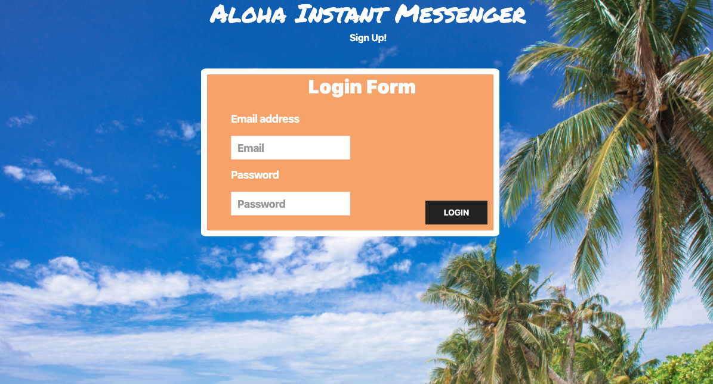
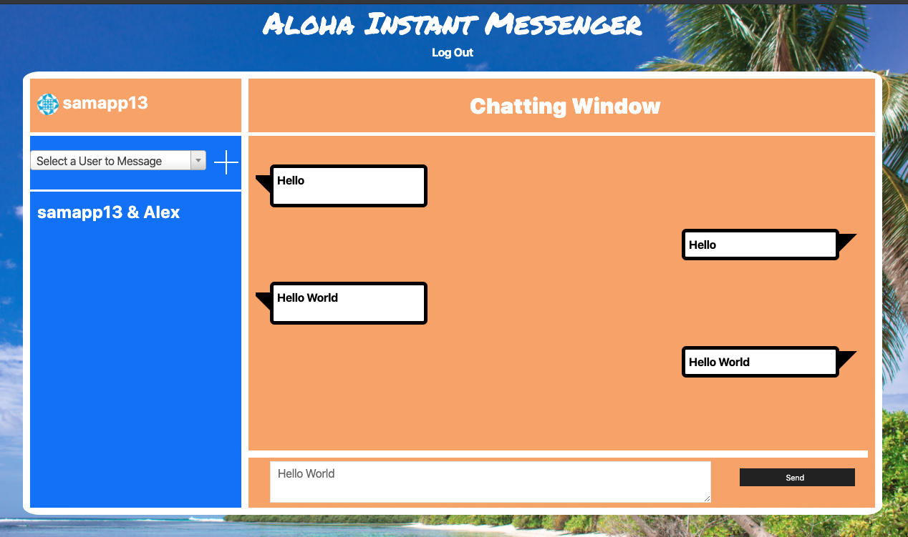

# Description
As part of our second group project, we decided to capitalize on the concept of a robust instant messenger that allows the user to communicate with family and friends with tropical colors that are easy on the eyes . We designed this app with simplicity in mind and implemented a user friendly interface that skips the clutter and get straight to the point. So if you're like us, hate dull imessage features and cannot wait till we can see our friends in person again, your chat room awaits you. Welcome to Aloha Instant Messenger.

# User Story:
As a user, I want to be able to:
Sign up and create an account.
Choose my avatar or have a default rendered.
See who is online and start a chat.

# Getting Started / Prerequisites
To install dependencies make sure to run:

npm i

Install MySql Workbench to handle the databases.
To use this app, run locally in your browser. Visit: localhost:8080

#  Technologies
Node and Express server
MySQL database and an ORM 
Sequelize
Handlebars
API's

# Demo
Checkout a live demo here!

# License
This product is licensed under MIT.